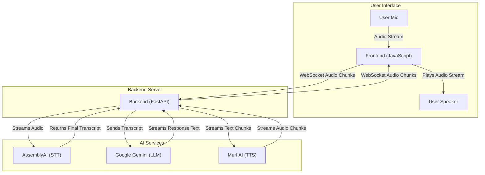

# 🌸 Meyme - AI Voice Agent

> A cozy, modern AI voice companion with personality — built for the 30 Days of AI Voice Agents Challenge by Murf AI

<p align="center">
  <a href="https://www.assemblyai.com/" target="_blank"></a>
  <a href="https://gemini.google.com/" target="_blank"></a>
  <a href="https://murf.ai/" target="_blank"></a>
  <a href="https://fastapi.tiangolo.com/" target="_blank"></a>
  <a href="https://en.wikipedia.org/wiki/WebSocket" target="_blank"></a>
  <a href="https://www.python.org" target="_blank"></a>
  <a href="https://developer.mozilla.org/en-US/docs/Web/HTML" target="_blank"></a>
  <a href="https://developer.mozilla.org/en-US/docs/Web/CSS" target="_blank"></a>
</p>

### 🎤 Demo

- 🌍 **[Live Website](https://meyme-the-cat.onrender.com/)**
- 🎥 **[Watch the Video](https://youtu.be/Ka7xC2NPk_k)**

## 🎯 What is Meyme?

Meet **Meyme** — she's not just another AI assistant. She's a fiercely loyal, cozy, and cunning cat companion with a lethal streak of sass. Built with a cutting-edge, fully streaming voice AI pipeline, Meyme brings personality and performance to every conversation. She's warm and affectionate with her owner, but everyone else? Well, let's just say you're probably wasting her precious nap time.

Think of her as your personal AI cat who happened to master human speech — and she's got *opinions*.

## ✨ Features

- 🎙️ **Real-time Voice Conversations:** Talk naturally with Meyme thanks to a low-latency, end-to-end streaming pipeline.
- 🎭 **Unique Personality:** A sassy, loyal cat with a distinct and consistent conversational style.
- 🧩 **Special Skills (Function Calling):** Capable of performing tasks like web searches to answer questions about current events.
- 📱 **Modern UI/UX:** A clean, glassmorphic design with smooth animations and audio visualizations.
- 🔄 **Session Persistence:** Remembers the context of the current conversation to handle follow-up questions.
- 🛡️ **Graceful Error Handling:** Provides fallback responses when downstream services are unavailable.
- 🔑 **User-Provided API Keys:** Allows users to input their own API keys directly in the UI.
- 🎯 **Smart Turn Detection:** Intelligently detects when the user has finished speaking to provide a seamless conversational flow.

## 🏗️ Architecture & Tech Stack

The final architecture is built around a **fully streaming, WebSocket-based pipeline** to ensure the lowest possible latency for a natural, real-time conversation.



**Tech Stack:**

| Technology | Purpose | Why We Chose It |
|------------|---------|----------------|
| **FastAPI** | Backend Framework | Lightning-fast async performance, WebSocket support, and automatic OpenAPI docs. |
| **AssemblyAI** | Speech-to-Text | Industry-leading accuracy and real-time streaming transcription. |
| **Google Gemini** | Language Model | Advanced conversational AI with function calling and personality customization. |
| **Murf AI** | Text-to-Speech | High-quality, natural-sounding voices with a crucial WebSocket streaming API. |
| **WebSockets** | Real-time Communication| The core technology for our interactive, bidirectional, low-latency pipeline. |
| **Vanilla JS** | Frontend Interactions | For real-time audio recording, visualization, and a seamless user experience. |

## 📚 Documentation

For a deeper dive into the project's architecture, code, and development journey, please visit the **[docs](./docs/)** directory. It contains:

- **[Architecture & Workflow](./docs/architecture.md):** A detailed explanation of the system design and data flow.
- **[Code Explained](./docs/code_explained.md):** A breakdown of the project structure and the role of each file.
- **[Product Requirements (PRD)](./docs/prd.md):** The vision, goals, and features of the agent.
- **[Tasks & Resources](./docs/resources.md):** A day-by-day guide to the 30-day challenge.

## 🚀 Getting Started

### Prerequisites

- **Python 3.8+**
- **pip** (Python package manager)
- A modern web browser with microphone access

### Environment Variables

You'll need API keys for the core services. Create a `.env` file in your project root by copying the example:

```bash
cp .env.example .env
```

Then, edit the `.env` file with your keys:

```bash
# .env

# Get from https://makersuite.google.com/app/apikey
GEMINI_API_KEY="your_gemini_api_key_here"

# Get from https://www.assemblyai.com/dashboard/signup
ASSEMBLYAI_API_KEY="your_assemblyai_api_key_here"

# Get from https://murf.ai/user/account/api-keys
MURF_API_KEY="your_murf_api_key_here"

# --- Optional: For Web Search Special Skill ---
# Choose one and uncomment it

# Get from https://serpapi.com/
# SERPAPI_API_KEY="your_serpapi_api_key_here"

# Get from https://tavily.com/
# TAVILY_API_KEY="your_tavily_api_key_here"
```

### Installation & Setup

1.  **Clone the repository:**
    ```bash
    git clone https://github.com/atharnex/30-days-of-ai-voice-agents.git
    cd 30-days-of-ai-voice-agents
    ```

2.  **Create and activate a virtual environment:**
    ```bash
    python -m venv venv
    source venv/bin/activate  # On Windows: venv\Scripts\activate
    ```

3.  **Install dependencies:**
    ```bash
    pip install -r requirements.txt
    ```

4.  **Run the application:**
    ```bash
    uvicorn main:app --reload
    ```

5.  **Access Meyme in your browser:**
    [http://localhost:8000](http://localhost:8000)

## 📂 Project Structure

```
.env.example
.gitignore
README.md
main.py
render.yaml
requirements.txt
schemas.py
docs/
├── architecture.md
├── code_explained.md
├── prd.md
└── resources.md
services/
├── __init__.py
├── llm.py
├── stt.py
└── tts.py
static/
├── fallback.mp3
├── script.js
└── style.css
templates/
└── index.html
```

---

**Challenge by:** [Murf AI](https://murf.ai) 🎵  
**Built by:** Athar  
**Challenge Hashtags:** `#30DaysOfAIVoiceAgents` `#MurfAI` `#BuildInPublic`
